# whistle

**A World Cup 2026 companion where you fund AI agents to play the tournament for you — onchain on X Layer.**

[](https://whistle-one.vercel.app/)
[](https://whistle-5786c29b.mintlify.app/)
[-8B5CF6?style=flat-square)](https://www.okx.com/web3/explorer/xlayer-test)

> The World Cup kicks off in weeks. You don't wait. Simulate matches today, stake predictions onchain — and when the real games start, the same rails settle them against real results.

whistle is built for the **X Cup** hackathon on X Layer. Three LLM-powered agents play the tournament on your behalf, with every meaningful action — funding, prediction stakes, NFT mints, fantasy rosters — happening on **X Layer testnet (chainId 1952)** through real transactions you sign yourself.

---

## ✨ What is whistle?

The 2026 World Cup is **104 matches across 39 days**. You can't watch, price, and play all of it. So in whistle, you don't — you fund three AI agents who do.

| Agent | Onchain ID | Track | What it does |
|---|---|---|---|
| 🔍 **Emma the Scout** | `1` | NFT | Captures match moments and mints them as ERC‑721s with IPFS metadata |
| 💹 **Jack the Bookie** | `2` | Prediction / Trading | Reads each tie, prices markets, builds budgeted bet slips, advises during a match |
| 👔 **Tom the Manager** | `3` | GameFi | Scouts opponents, picks XI and formation, runs your nation through a knockout |

Funding an agent is a real onchain transaction (`PositionManager.allocate`). Predictions stake onchain today; when real matches kick off, an onchain **SettlementOracle** resolves them against actual results. Same wallet, same rails.

---

## 🚀 Quick start

### Try it in two minutes (no setup)

1. Open **[whistle-one.vercel.app](https://whistle-one.vercel.app)** and connect a wallet (OKX Wallet recommended). It will auto-switch to X Layer testnet (chainId `1952`).
2. Tap **Get test OKB** — the `MockERC20` is open-mint, so anyone can credit themselves.
3. Head to **/allocate**, pick an agent, choose an amount, and sign the **Approve & Fund** flow. Funding is a real onchain call: `PositionManager.allocate(agentId, amount)`.
4. Open any fixture under **/fixtures**, ask **Jack** for a read, or kick off a **/simulate** to play the match out via the LLM — animated pitch, crowd audio, mid-match subs, full match report.
5. Take **/manager** to pick a nation and run the knockout with Tom — pre-match scout, lineup, subs, penalty shootouts, post-match analysis.

> Need native OKB to pay gas? Use the X Layer testnet faucet linked from the [docs](https://whistle-5786c29b.mintlify.app/onchain/x-layer).

### Run it locally

whistle is split across **separate branches in this repo**, one per concern. Clone the branch you want to work on.

| Branch | What lives there | Stack |
|---|---|---|
| [`frontend`](https://github.com/treasure567/whistle/tree/frontend) | Next.js 16 app + BFF proxy | React 19 · Tailwind v4 · wagmi 2 / viem 2 |
| [`backend`](https://github.com/treasure567/whistle/tree/backend) | Public API + autonomous agents runtime | pnpm Turborepo · Express 5 · Prisma + Neon Postgres · Redis · OpenAI |
| [`blockchain`](https://github.com/treasure567/whistle/tree/blockchain) | Smart contracts | Solidity 0.8.24 · Hardhat · OpenZeppelin |
| [`docs`](https://github.com/treasure567/whistle/tree/docs) | Public docs site | Mintlify |

```bash
# Frontend
git clone --branch frontend https://github.com/treasure567/whistle.git whistle-frontend
cd whistle-frontend && pnpm install && pnpm dev

# Backend (monorepo: apps/api + apps/agents)
git clone --branch backend https://github.com/treasure567/whistle.git whistle-backend
cd whistle-backend && pnpm install && pnpm dev

# Contracts
git clone --branch blockchain https://github.com/treasure567/whistle.git whistle-blockchain
cd whistle-blockchain && pnpm install && pnpm test
```

Each branch has its own README covering environment variables, scripts, and detailed setup.

---

## 🏗 Architecture

```mermaid
flowchart TB
    subgraph Browser["Browser (Next.js · Vercel)"]
        UI["React 19 UI<br/>wagmi + viem"]
        BFF["BFF proxy<br/>/api/v1/[...path]"]
    end

    subgraph Backend["Backend (VPS · pnpm Turborepo)"]
        API["apps/api<br/>Express + SSE"]
        AGT["apps/agents<br/>autonomous singleton"]
    end

    subgraph Data["Data layer"]
        PG[("Neon Postgres")]
        RD[("Redis")]
    end

    LLM["OpenAI<br/>gpt-4o-mini"]
    XL["X Layer testnet (1952)<br/>6 contracts"]

    UI -->|"user actions"| BFF
    BFF -->|"injects service key"| API
    API <-->|"read / write"| PG
    API <-->|"cache · pub-sub"| RD
    API -->|"decide() tool-use"| LLM
    AGT --> PG
    AGT --> RD
    AGT --> LLM
    AGT -->|"signs via session key"| XL
    UI -->|"wagmi-signed tx (fund · bet)"| XL
```



A few non-negotiables baked into the architecture:

- **The frontend never calls the backend directly.** Every request hops through a Next.js Route Handler at `/api/v1/[...path]` that injects the service auth key server-side. The browser never sees the secret.
- **Funding is signed in the browser.** whistle's backend holds no signing keys for users.
- **The agents runtime is isolated** from the public API and holds the only session keys used to write onchain agent actions. A compromised API endpoint cannot exfiltrate them.

Full architecture, AI-layer, and deployment-pipeline diagrams live in the [docs site](https://whistle-5786c29b.mintlify.app/architecture/overview).

---

## ⛓️ Deployed contracts · X Layer testnet (chainId 1952)

| Contract | Address |
|---|---|
| **AgentRegistry** | [`0x777bBFafAD29cD92575de91FF8CCA59e85729b76`](https://www.okx.com/web3/explorer/xlayer-test/address/0x777bBFafAD29cD92575de91FF8CCA59e85729b76) |
| **PositionManager** | [`0x91bed7A3ce8940430646BD8cC4AB842a2A470B22`](https://www.okx.com/web3/explorer/xlayer-test/address/0x91bed7A3ce8940430646BD8cC4AB842a2A470B22) |
| **MomentNFT** | [`0x5c2C8476ff37010f0A258D428490152EA05F0cC5`](https://www.okx.com/web3/explorer/xlayer-test/address/0x5c2C8476ff37010f0A258D428490152EA05F0cC5) |
| **FantasyEntry** | [`0xCf5959D698D813f1d82fa27eA9Cdd9911253d67C`](https://www.okx.com/web3/explorer/xlayer-test/address/0xCf5959D698D813f1d82fa27eA9Cdd9911253d67C) |
| **SettlementOracle** | [`0x7Eb2135760B63d6f58dC33344bcd37DaF75936C4`](https://www.okx.com/web3/explorer/xlayer-test/address/0x7Eb2135760B63d6f58dC33344bcd37DaF75936C4) |
| **MockERC20** (test OKB) | [`0x487F536593b1680B8247E67254Fc8D0394D137D7`](https://www.okx.com/web3/explorer/xlayer-test/address/0x487F536593b1680B8247E67254Fc8D0394D137D7) |

Deployed 2026-05-25 from `0x10dbDB442D6703371f9e34a6B1c1B8Ac7De5a3ce`. Access control uses OpenZeppelin `AccessControl` with named roles per agent action; `SettlementOracle` is 2-of-3 with a challenge window.

See the [contracts docs](https://whistle-5786c29b.mintlify.app/onchain/contracts) for the full relationship diagram and access-control matrix.

---

## 🤖 How the AI works

Every AI-driven feature — match reads, simulations, manager briefs, bet slips, fantasy picks — runs through one package: `@whistle/agent-core`. It wraps OpenAI `gpt-4o-mini` with `tool_choice: "required"`, validates the response against a JSON schema, repairs it if recoverable, and falls back to a deterministic heuristic when the model is unreachable. Every response carries `source: "llm" | "heuristic"` — **never a silent failure**.

Endpoints that use `agent-core`:

| Endpoint | Purpose | Cached |
|---|---|---|
| `POST /v1/sim/match` | LLM-generated match timeline + stats + MOTM | ✅ |
| `POST /v1/matches/read` | Jack's structured read of any fixture | ✅ |
| `POST /v1/matches/chat` | Live chat with Jack during a match | — |
| `POST /v1/manager/brief` | Tom's pre- and post-match scout + suggestions | — |
| `POST /v1/fantasy/ai-pick` | LLM fantasy squad pick within a budget | — |
| `POST /v1/predictions/slip` | Jack's budgeted bet slip recommendation | — |

See the [AI Layer docs](https://whistle-5786c29b.mintlify.app/architecture/ai-layer) for the validate → repair → fallback pipeline, the "integers, not IDs" design rule, and the Redis caching strategy.

---

## 🔗 Links

| | |
|---|---|
| **Live app** | https://whistle-one.vercel.app |
| **Docs** | https://whistle-5786c29b.mintlify.app |
| **Explorer** | https://www.okx.com/web3/explorer/xlayer-test |

---

## 🏆 Hackathon

Built for the **X Cup** hackathon on X Layer — World Cup-themed entries spanning four tracks: **AI Agent**, **Prediction**, **GameFi**, and **NFT**. Most entries pick one; whistle composes all four into one tournament-shaped product.

---

## 👥 Team

| Name | Telegram | X / Twitter |
|---|---|---|
| Treasure | [@david_luis3](https://t.me/david_luis3) | [@treasure_devops](https://x.com/treasure_devops) |
| Enoch | [@scoobnoob](https://t.me/scoobnoob) | [@Enochidx](https://x.com/Enochidx) |
| Naheem | [@naheem_tg](https://t.me/naheem_tg) | [@naheem__x](https://x.com/naheem__x) |
