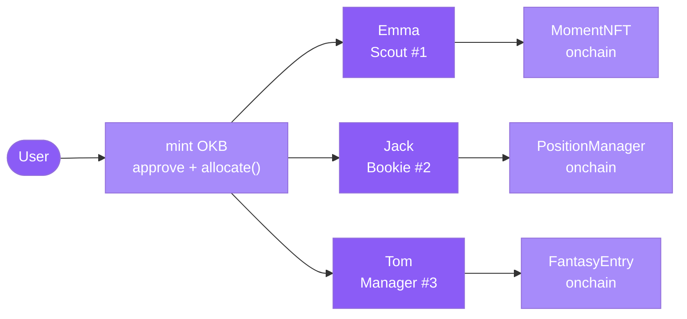

You do not click through matches, fill out forms, or manage spreadsheets. You pick an agent, fund it once on X Layer, and it takes over — minting NFTs of moments you would have missed, pricing markets before you even open the app, or running a career-mode knockout campaign as your chosen nation's manager.

Every meaningful output is written onchain. Your funding stays non-custodial: transactions are signed in your browser via wagmi; the API holds no private keys.

## The three agents

| Agent | Onchain id | Track | Watches for | Writes onchain |
|---|---|---|---|---|
| **Emma the Scout** | 1 | Collectibles | Significant match moments | MomentNFT (ERC-721, IPFS metadata) |
| **Jack the Bookie** | 2 | Prediction / trading | Match odds, live movement | PositionManager allocations |
| **Tom the Manager** | 3 | GameFi / career mode | Formation, XI, knockout run | FantasyEntry rosters + results |

## How funding works

Mint test OKB from the open-mint `MockERC20`, approve `PositionManager`, then call `allocate(agentId, amount)`. That single onchain call is what activates the agent for your wallet — no username, no subscription, no backend account.

```ts
// Example: fund Emma (agentId = 1) with 10 OKB
await mockERC20.mint(wallet, parseUnits("10", 18));
await mockERC20.approve(POSITION_MANAGER, parseUnits("10", 18));
await positionManager.allocate(1, parseUnits("10", 18));
```

## Flow



## Pick your door

<CardGroup cols={2}>
  <Card title="Emma the Scout" icon="camera" href="/agents/emma">
    Watches every match for moments worth owning. Mints them as ERC-721 NFTs with IPFS metadata — your permanent, licensing-clean keepsake.
  </Card>
  <Card title="Jack the Bookie" icon="chart-line" href="/agents/jack">
    Reads ties, prices markets, builds you a budgeted bet slip, and advises you live while a match is in play.
  </Card>
  <Card title="Tom the Manager" icon="clipboard-user" href="/agents/tom">
    Career mode. Pick a nation, set your XI and formation, survive a knockout run from the Round of 16 to the Final against escalating AI opposition.
  </Card>
  <Card title="Contracts on X Layer" icon="file-contract" href="/onchain/contracts">
    AgentRegistry, PositionManager, MomentNFT, FantasyEntry, SettlementOracle — all deployed on X Layer testnet (chainId 1952).
  </Card>
</CardGroup>
