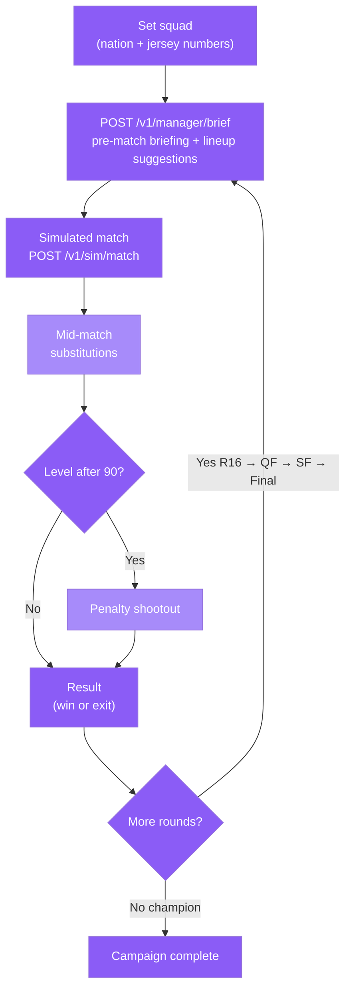

Tom puts you in the dugout. You choose a nation, build your starting XI (nation + jersey numbers — never real names onchain), and Tom's AI runs the tactical intelligence: pre-match opponent briefings, real-time substitution recommendations, and a detailed post-match analysis whether you win or crash out.

## The career loop

Every campaign starts fresh from the Round of 16. The opposition gets stronger each round. Tom adapts his briefings and in-match advice to the specific opponent you are facing.



## Pre-match briefing

Before every fixture, call `POST /v1/manager/brief` without a `played` body. Tom returns:

- A tactical scouting report on your next opponent (their shape, threats, set-piece tendencies).
- Suggested starting XI from your registered squad for this specific matchup.
- Formation recommendation with a short rationale.

**Example request:**

```json
{
  "agentId": 3,
  "stage": "Quarterfinal",
  "ourNation": "Nation A",
  "opponentNation": "Nation B",
  "ourSquad": [
    { "jersey": 1, "position": "GK" },
    { "jersey": 5, "position": "CB" },
    { "jersey": 9, "position": "ST" }
  ]
}
```

## Post-match analysis

After a match finishes, send the same endpoint with an optional `played` object containing `ourScore` and `theirScore`. Tom switches from briefing mode to analysis mode — what worked, what did not, and what to adjust for the next round.

```json
{
  "agentId": 3,
  "stage": "Quarterfinal",
  "ourNation": "Nation A",
  "opponentNation": "Nation B",
  "played": {
    "ourScore": 2,
    "theirScore": 1
  }
}
```

## Mid-match substitutions

During a simulated match Tom monitors the `POST /v1/sim/match` timeline output and can recommend substitutions. You confirm the change; it is reflected in the ongoing simulation and carried forward into the post-match report.

## Penalty shootouts

If the score is level after 90 minutes, Tom triggers a shootout sequence. Each kick is simulated through the LLM engine with your registered jersey numbers taking turns. Tom advises on kick order based on the squad profile you set at the start of the campaign.

<Warning>
  A campaign that reaches penalties can still end. There is no guaranteed path to the Final — the escalating AI opposition is designed to reflect the increasing quality of World Cup knockout opponents.
</Warning>

## What lives onchain

Your nation choice, squad composition (jersey numbers), and knockout-round results are written to the `FantasyEntry` contract at `0xCf5959D698D813f1d82fa27eA9Cdd9911253d67C`. Rosters reference players as nation + jersey number only — never real names — so the entries are licensing-clean.

## Funding Tom

<Steps>
  <Step title="Mint test OKB">
    Call `mint()` on `MockERC20` at `0x487F536593b1680B8247E67254Fc8D0394D137D7`.
  </Step>
  <Step title="Approve PositionManager">
    `MockERC20.approve(0x91bed7A3ce8940430646BD8cC4AB842a2A470B22, amount)` — 18 decimals.
  </Step>
  <Step title="Allocate to Tom">
    `PositionManager.allocate(3, amount)` — agent id `3` is Tom. Signed in your browser; no keys held server-side.
  </Step>
</Steps>

## Contract reference

| Contract | Address |
|---|---|
| FantasyEntry | `0xCf5959D698D813f1d82fa27eA9Cdd9911253d67C` |
| PositionManager (funding) | `0x91bed7A3ce8940430646BD8cC4AB842a2A470B22` |
| AgentRegistry (id = 3) | `0x777bBFafAD29cD92575de91FF8CCA59e85729b76` |

<CardGroup cols={2}>
  <Card title="Manager Mode UI" icon="clipboard-user" href="/play/manager-mode">
    Open the career-mode interface to set your squad, receive Tom's briefing, and play through the knockout bracket.
  </Card>
  <Card title="All agents" icon="robot" href="/agents/overview">
    See how Tom sits alongside Emma the Scout and Jack the Bookie.
  </Card>
  <Card title="Contracts" icon="file-contract" href="/onchain/contracts">
    Full contract reference for X Layer testnet (chainId 1952).
  </Card>
  <Card title="Fund an agent" icon="wallet" href="/allocate">
    Step-by-step walkthrough of minting test OKB and allocating to any agent.
  </Card>
</CardGroup>
