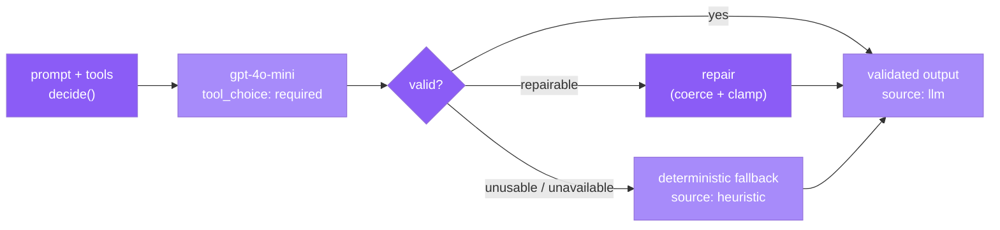

Every AI-driven feature in whistle — whether an API advisor endpoint or an autonomous agent action — runs through the same package: `@whistle/agent-core`. It provides a single `decide()` function that enforces tool use, validates the response, repairs it when possible, and falls back to a deterministic heuristic when the model is unavailable or returns unusable output.

## The decide() call

`decide()` wraps an OpenAI chat-completion with `tool_choice: "required"`, which forces the model to return a structured tool call rather than a prose reply. The caller supplies a system prompt, a user prompt, and a tools array. Each tool has a `name`, a `description`, and an `inputSchema` (JSON Schema).

```ts
import { decide } from "@whistle/agent-core";

const result = await decide({
  system: "You are Jack, a football betting advisor. Always use the provided tools.",
  prompt: `Match: ${match.homeTeam} vs ${match.awayTeam}. Recommend a bet slip.`,
  tools: [
    {
      name: "recommend_slip",
      description: "Return a budgeted bet slip for the match.",
      inputSchema: {
        type: "object",
        properties: {
          marketIndex:  { type: "integer", minimum: 0, maximum: 2 },
          outcomeIndex: { type: "integer", minimum: 0, maximum: 2 },
          stakePercent: { type: "integer", minimum: 5, maximum: 50 },
          rationale:    { type: "string",  maxLength: 280 },
        },
        required: ["marketIndex", "outcomeIndex", "stakePercent", "rationale"],
      },
    },
  ],
});

// result.source is "llm" | "heuristic"
```

<Note>
`tool_choice: "required"` is not optional. Without it, the model may return a prose answer instead of a structured call, which the downstream validator cannot process.
</Note>

## Validation, repair, and fallback

After the model responds, `agent-core` runs a three-stage pipeline:



1. **Validate** — the tool call arguments are checked against the declared `inputSchema`. Fields are type-checked and range-constrained.
2. **Repair** — if a field is out of range or the wrong type but recoverable (e.g. a float where an integer was expected, or a value one step outside a bound), it is coerced to the nearest legal value rather than discarded.
3. **Fallback** — if the model is unreachable, returns no tool call, or the arguments cannot be repaired, a deterministic engine takes over and produces a heuristic result. The caller always receives a response; it is never a silent failure.

Every response carries `source: "llm" | "heuristic"` so callers and clients can surface the distinction.

## The integers-not-ids lesson

A key design rule throughout whistle: **have the model return integers and indices, never opaque database IDs or free-form strings that must resolve to records**.

For example, a market selection is returned as `marketIndex: 1` (home / draw / away) rather than a UUID or a league-specific string. The validator maps the integer to a concrete market record after validation. This pattern makes repair trivially cheap — clamp an out-of-range integer — and prevents the model from hallucinating an ID that does not exist in the database.

The same principle applies to formation slots, knockout-round indices, and fantasy player positions.

## Redis caching

Results for stable, deterministic inputs are cached in Redis to avoid redundant model calls and reduce latency.

```
cache key: whistle:<endpoint>:<matchId>   (e.g. whistle:match-read:fixture_042)
TTL:       set per endpoint based on how quickly the underlying data changes
```

Endpoints with cached results: match reads (`/v1/matches/read`) and match simulations (`/v1/sim/match`). Live-advisory endpoints (`/v1/matches/chat`, `/v1/predictions/slip`) are not cached because they depend on in-progress match state.

<Tip>
The agents runtime also uses `agent-core` and shares the same Redis cache. If the API has already primed a match-read result, the agent loop picks it up from cache rather than making a second model call.
</Tip>

## Endpoints that use agent-core

| Endpoint | Consumer | Cached |
|---|---|---|
| `POST /v1/matches/read` | apps/api + apps/agents | Yes |
| `POST /v1/matches/chat` | apps/api | No |
| `POST /v1/sim/match` | apps/api + apps/agents | Yes |
| `POST /v1/manager/brief` | apps/api + apps/agents | No |
| `POST /v1/fantasy/ai-pick` | apps/api | No |
| `POST /v1/predictions/slip` | apps/api | No |

---

- See [Architecture Overview](/architecture/overview) for how `agent-core` fits into the broader monorepo.
- See [API Reference](/api-reference/match-ai) for the HTTP contracts on the advisor endpoints.
