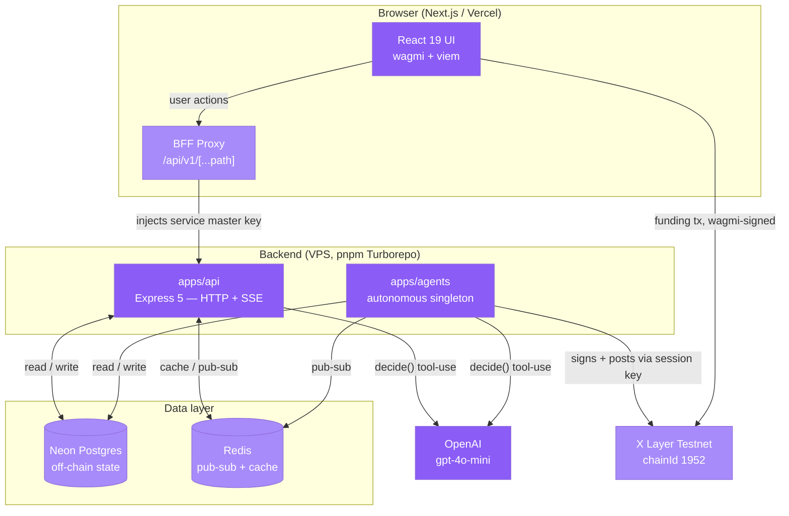

whistle is a World Cup 2026 companion where users fund AI agents with onchain OKB. The system is split into two distinct concerns: a **public API** that serves data and LLM-backed advisor endpoints, and an **autonomous agents runtime** that watches matches, makes decisions, and signs transactions — without those keys ever touching the public network surface.

## System diagram

## Why two backend apps?

The key architectural decision is the split between `apps/api` and `apps/agents`.

**`apps/api`** is the public HTTP and SSE surface. It serves all data endpoints and the LLM-backed advisor endpoints (match reads, chat, simulation, manager brief, fantasy pick, bet slip). It holds **no signing keys** — it cannot post transactions to the chain.

**`apps/agents`** is an autonomous singleton runtime. A per-match scheduler triggers the Scout, Bookie, and Manager agent loops. Each loop calls the LLM under a tool-use schema, validates the output, then signs and posts an onchain action via a **session key** held only in this isolated process. Every decision — the prompt sent, the model response, the action taken, and the resulting transaction hash — is written to Postgres for a full audit trail.

This separation means a compromised public API endpoint cannot exfiltrate a signing key or post fraudulent onchain actions on behalf of the agents.

## The BFF proxy

The Next.js frontend **never calls the backend API directly**. Every request goes through a Next.js Route Handler at `/api/v1/[...path]` which injects the `SERVICE_AUTH_SECRET` server-side before forwarding to `apps/api`. Funding transactions are a separate concern: they are signed in the user's browser via wagmi — no private keys leave the user.

## Five-layer model

Both `apps/api` and `apps/agents` follow the same five-layer structure. Dependencies flow strictly downward; no layer skips a level.

| Layer | Responsibility |
|---|---|
| **Routes** | Parse HTTP request, call controller, return response |
| **Controllers** | Orchestrate: validate input, call one or more services |
| **Services** | Business logic — LLM calls, simulations, match logic |
| **Repositories** | All Prisma / database access; no business logic |
| **Dependencies** | Shared packages injected at startup |

## Shared packages

The monorepo is managed with pnpm + Turborepo. All shared code lives in `packages/`:

<CardGroup cols={3}>
  <Card title="@whistle/types" icon="code">
    TypeScript types and Zod schemas shared across apps.
  </Card>
  <Card title="@whistle/errors" icon="shield">
    Typed error classes and HTTP error helpers.
  </Card>
  <Card title="@whistle/config" icon="layer-group">
    The single zod-validated env access point. No app reads `process.env` directly.
  </Card>
  <Card title="@whistle/logger" icon="database">
    pino-based structured logger, consistent across both apps.
  </Card>
  <Card title="@whistle/observability" icon="gauge">
    `/healthz`, `/readyz`, `/metrics`, and request-id middleware.
  </Card>
  <Card title="@whistle/db" icon="database">
    Prisma client and all schema migrations.
  </Card>
  <Card title="@whistle/chain" icon="diagram-project">
    viem clients, ABIs, and deployed contract addresses for X Layer.
  </Card>
  <Card title="@whistle/agent-core" icon="robot">
    LLM client and the `decide()` tool-use interface used by both apps.
  </Card>
</CardGroup>

## Go deeper

<CardGroup cols={3}>
  <Card title="AI Layer" icon="robot" href="/architecture/ai-layer">
    How `decide()` works, tool-use schema, validation + repair, Redis caching, and the deterministic fallback.
  </Card>
  <Card title="Deployment" icon="rocket" href="/architecture/deployment">
    Vercel frontend, GitHub Actions VPS pipeline, atomic symlink releases, Hardhat Ignition to X Layer.
  </Card>
  <Card title="Contracts" icon="diagram-project" href="/onchain/contracts">
    AgentRegistry, PositionManager, MomentNFT, FantasyEntry, SettlementOracle — all on X Layer testnet.
  </Card>
</CardGroup>
