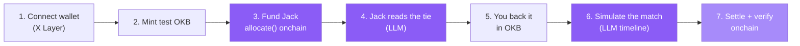

It's a Tuesday in June. Argentina play Brazil tonight and you're in a
meeting until kickoff. You won't be watching the markets move. So you open
whistle and let Jack work it for you.

## 1. You connect a wallet

<Steps>
  <Step title="Connect">
    OKX Wallet (recommended), or any browser / WalletConnect / Coinbase
    wallet. whistle runs on **X Layer testnet (chainId 1952)**; if you're
    on the wrong network it switches you automatically on connect.
  </Step>
  <Step title="Get test OKB">
    The funding token is an open-mint test **OKB** (a `MockERC20` on
    testnet), so anyone can mint a balance and play. Your live OKB balance
    shows in the navbar.
  </Step>
</Steps>

## 2. You fund Jack — and that's a transaction

You decide Jack gets 50 OKB to work tonight's matches. Funding is not a
database row; it's three onchain steps the browser signs:

<Steps>
  <Step title="Mint">
    If you're short, the app mints the difference in test OKB to your
    wallet.
  </Step>
  <Step title="Approve">
    You approve the `PositionManager` to move that OKB.
  </Step>
  <Step title="Allocate">
    `PositionManager.allocate(agentId, amount)` credits Jack's budget
    onchain. Jack is agent `2` in the registry. The transaction confirms
    live in the UI.
  </Step>
</Steps>

<Note>
whistle never holds your keys. Funding is signed in your browser; the API
holds no signing secrets. See [Funding flow](/onchain/funding-flow).
</Note>

## 3. Jack reads the tie

You open Argentina vs Brazil. Jack returns a read — win/draw/win
percentages, two or three markets with his lean, and a one-line take in
his own voice — generated by the LLM and cached so the next fan who opens
the same tie gets it instantly.

> *"Argentina edge it at 2.10, but Brazil are dangerous on the counter.
> I'd lean the draw as value, and both teams to score looks live."*

You can ask follow-ups; Jack answers and suggests new questions to pull.

## 4. You back it in OKB

Jack's desk shows the three prices. You take the draw, stake what you're
comfortable with, and place it. Your real onchain OKB shows alongside the
sandbox you bet with (simulated matches have no settlement oracle, so the
bet ledger is a sandbox — the balance and the integration are real).

## 5. You play the match out

Hit kick-off and the **match is generated by the LLM**: a minute-by-minute
timeline with real scorers, cards, penalties, stats and a man of the
match. It plays back live — animated field, crowd audio that swells on a
goal, Jack calling how your bet is faring — and ends with a full match
report and the scorers.

<Steps>
  <Step title="Live">
    Commentary streams minute by minute; the ball and players move on the
    flat field; Jack reacts to the scoreline.
  </Step>
  <Step title="Full-time">
    Match report: possession, shots, corners, fouls, cards, MOTM, and the
    scorers. Your bet settles against the result.
  </Step>
</Steps>

## What you just touched

<CardGroup cols={3}>
  <Card title="An onchain agent" icon="link" href="/onchain/contracts">
    You funded a registered agent with OKB through a real contract call.
  </Card>
  <Card title="The AI layer" icon="robot" href="/architecture/ai-layer">
    Jack's read and the whole match came from an LLM with a tool-use
    contract and a deterministic fallback.
  </Card>
  <Card title="The three doors" icon="users" href="/agents/overview">
    Emma keeps the moment, Jack prices the bet, Tom would let you manage a
    nation through the whole thing.
  </Card>
</CardGroup>

<Card title="Try it yourself" icon="bolt" href="/quick-start">
  The quick start walks the same arc in five minutes on the live testnet.
</Card>
