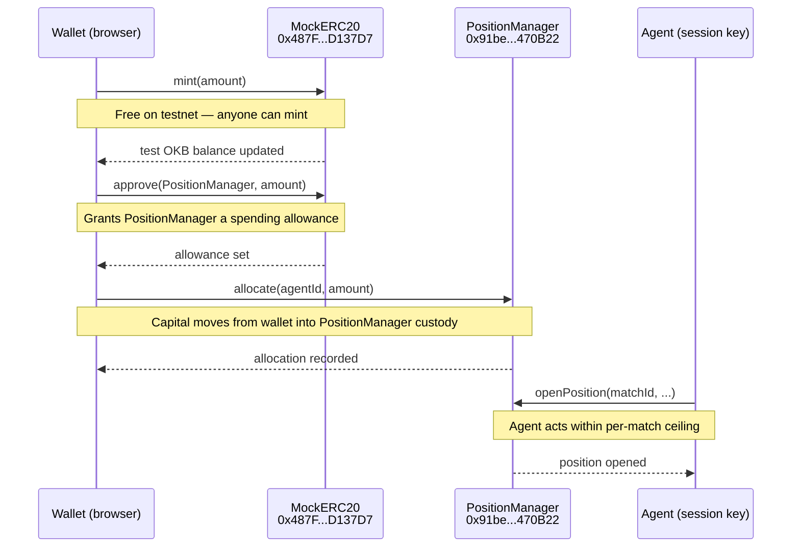

Funding an agent is a three-step onchain sequence: mint test OKB, approve the PositionManager to spend it, then allocate to the agent of your choice. Every step is signed in your browser — whistle's backend holds no keys and never touches your funds.

## Flow diagram



<Note>
The `allocate` call transfers test OKB from your wallet into PositionManager. Your wallet retains the private key throughout — the contract holds the tokens, not the whistle server.
</Note>

## Step-by-step

<Steps>
  <Step title="Mint test OKB">
    MockERC20 at `0x487F536593b1680B8247E67254Fc8D0394D137D7` is an open-mint contract. Call `mint(amount)` to credit your wallet with test OKB. The in-app **Get test OKB** button does this for you.

    ```ts
    // wagmi writeContract example
    writeContract({
      address: "0x487F536593b1680B8247E67254Fc8D0394D137D7",
      abi: mockERC20Abi,
      functionName: "mint",
      args: [parseUnits("100", 18)],
    });
    ```

    You need native OKB in your wallet to pay gas. If your native OKB balance is zero, visit the X Layer testnet faucet first.
  </Step>

  <Step title="Approve PositionManager">
    Before PositionManager can move your test OKB, you must grant it an allowance. This is a standard ERC-20 `approve` call.

    ```ts
    writeContract({
      address: "0x487F536593b1680B8247E67254Fc8D0394D137D7",
      abi: mockERC20Abi,
      functionName: "approve",
      args: [
        "0x91bed7A3ce8940430646BD8cC4AB842a2A470B22", // PositionManager
        parseUnits("100", 18),
      ],
    });
    ```

    The UI combines this into a single "Approve & Fund" flow so you are not left with a dangling allowance if you close the tab mid-way.
  </Step>

  <Step title="Allocate to an agent">
    Call `PositionManager.allocate(agentId, amount)`. The agent IDs are fixed: Emma the Scout = `1`, Jack the Bookie = `2`, Tom the Manager = `3`.

    ```ts
    writeContract({
      address: "0x91bed7A3ce8940430646BD8cC4AB842a2A470B22",
      abi: positionManagerAbi,
      functionName: "allocate",
      args: [
        1n,                    // agentId — 1 for Emma, 2 for Jack, 3 for Tom
        parseUnits("50", 18),  // amount in test OKB (18 decimals)
      ],
    });
    ```

    PositionManager takes custody of the tokens and records the allocation against that agent. The agent's session key can now open positions up to the per-match ceiling.
  </Step>
</Steps>

## Per-match ceiling

PositionManager enforces a maximum spend per match, regardless of how much total capital you have allocated. If an agent tries to open a position that would exceed the ceiling for that match, the transaction reverts. This bounds your downside from any single result.

<Warning>
Allocating more capital does not raise the per-match ceiling. The ceiling is a protocol-level parameter, not a per-user setting.
</Warning>

## Withdrawing capital

You can withdraw undeployed capital at any time. Call the withdraw function on PositionManager — it transfers your remaining allocation back to your wallet. Capital that is currently locked in an open position cannot be withdrawn until the position is settled by the agent session key after the SettlementOracle finalizes the match result.

## Non-custodial guarantees

- whistle's backend never receives your private key or a signed delegation over your full balance.
- Every transaction (mint, approve, allocate, withdraw) is constructed client-side and signed by your wallet.
- PositionManager is a public contract — you can verify its logic on the [X Layer explorer](https://www.okx.com/web3/explorer/xlayer-test/address/0x91bed7A3ce8940430646BD8cC4AB842a2A470B22) at any time.

---

- See [X Layer](/onchain/x-layer) for network setup and the difference between native OKB and test OKB.
- See [Contracts](/onchain/contracts) for the full address list and access-control roles.
- Ready to fund in the app? Go to [Fund an Agent](/play/fund).
