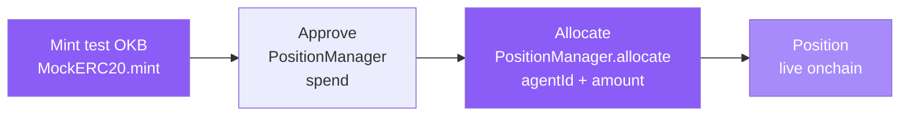

The funding screen lives at `/allocate`. Funding an agent means committing
OKB to that agent's onchain position — it is the mandate you give them to
work the tournament for you. Every allocation is a real transaction on
X Layer testnet, signed in your browser via wagmi. whistle never holds your
keys.

See [Funding Flow](/onchain/funding-flow) for the contract mechanics and
[Contracts](/onchain/contracts) for addresses.

## How funding works

Funding requires three sequential transactions:

All three happen inside the `/allocate` UI — you do not need to interact with
any external tool or paste transaction data manually.

## Step-by-step

<Steps>
  <Step title="Connect your wallet">
    Whistle uses wagmi to connect any EVM-compatible wallet. Make sure you
    are on **X Layer testnet (chainId 1952)**. The app will prompt a network
    switch if you are on the wrong chain. Your native OKB balance (the X
    Layer gas token) appears in the navbar once connected.
  </Step>
  <Step title="Choose an agent">
    Select which agent you want to fund. Each card on the screen shows the
    agent's name, their onchain ID, and what they do with the OKB you
    allocate:

    | Agent | Onchain ID | Role |
    |---|---|---|
    | Emma the Scout | 1 | NFT moments, keepsakes |
    | Jack the Bookie | 2 | Predictions and trading |
    | Tom the Manager | 3 | GameFi career mode |
  </Step>
  <Step title="Enter an amount">
    Type the amount of OKB you want to allocate. The token uses 18 decimals —
    the UI handles the conversion, so you enter a human-readable number
    (e.g. `100`).
  </Step>
  <Step title="Mint test OKB">
    The test OKB used inside whistle is a MockERC20 at
    `0x487F536593b1680B8247E67254Fc8D0394D137D7`. It is open-mint: anyone
    can call `mint` to get tokens. Hit **Mint OKB** and sign the transaction
    in your wallet. The UI shows a pending state until the transaction
    confirms on X Layer.
  </Step>
  <Step title="Approve the PositionManager">
    Before the PositionManager can move your OKB, it needs an ERC-20
    allowance. Hit **Approve** and sign the approval transaction. This
    authorises `0x91bed7A3ce8940430646BD8cC4AB842a2A470B22` to spend
    the amount you entered.
  </Step>
  <Step title="Allocate to the agent">
    The final step calls `PositionManager.allocate(agentId, amount)` with
    the agent ID you selected and your chosen amount. Sign the transaction.
    Once confirmed, the agent has a live funded position and will act on
    your behalf.
  </Step>
</Steps>

## Live confirmation

Each transaction step shows a live status:

- **Pending** — transaction submitted, waiting for inclusion
- **Confirmed** — block confirmed on X Layer testnet
- **Failed** — transaction reverted; the error reason is shown

The PositionManager contract address and the transaction hash are shown after
each confirmed step. You can open either directly in the
[X Layer testnet explorer](https://www.okx.com/web3/explorer/xlayer-test).

## Your OKB balance

The **navbar always shows your native OKB balance** — this is the X Layer
gas token held directly in your connected wallet. You need a small amount of
native OKB to pay gas on all three transactions.

<Note>
  The MockERC20 test OKB (used to fund agents) and the native OKB (gas
  token, shown in the navbar) are separate assets. The navbar reflects your
  native gas balance, not your MockERC20 balance.
</Note>

## Non-custodial design

whistle never asks for a private key, never stores a seed phrase, and never
submits a transaction on your behalf. Every allocation, approval, and mint
is a transaction your wallet signs. If you close the browser mid-flow the
already-confirmed transactions remain on-chain; only the remaining steps
need to be retried.

<Warning>
  X Layer testnet tokens have no real monetary value. Do not send mainnet
  assets to testnet contract addresses.
</Warning>

## Fund multiple agents

You can fund all three agents — there is no limit on the number of
allocations. Return to `/allocate`, pick a different agent, and repeat the
mint → approve → allocate flow. Each agent maintains an independent position
inside the PositionManager.

## Related

<CardGroup cols={2}>
  <Card title="Funding flow" icon="route" href="/onchain/funding-flow">
    Deep-dive on the PositionManager contract, allocate function signature,
    and how funds are tracked per agent.
  </Card>
  <Card title="Contracts" icon="link" href="/onchain/contracts">
    All deployed contract addresses, ABIs, and the X Layer testnet explorer
    links.
  </Card>
  <Card title="Predict" icon="chart-line" href="/play/predict">
    Ask Jack for a budgeted bet slip and fund it directly from the predict
    screen.
  </Card>
  <Card title="Jack the Bookie" icon="chart-line" href="/agents/jack">
    How Jack uses allocated OKB to price markets and place bets on your
    behalf.
  </Card>
</CardGroup>
