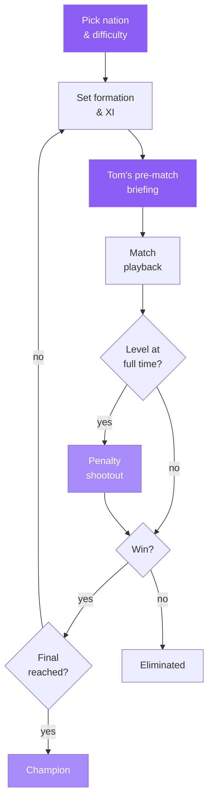

Manager mode lives at `/manager`. You choose a nation and a difficulty, then
Tom the Manager scouts each opponent, helps you set your lineup, and walks you
back through the result win, lose, or draw — all the way to the Final, with
penalty shootouts on level ties.

See [Tom the Manager](/agents/tom) for how he decides what to say.

## The round loop

Each round of the knockout follows the same cycle before advancing:



Each time you advance, the flow returns to the **briefing screen first** — so
you always know who you're facing before you lock in a lineup.

## Playing a round

<Steps>
  <Step title="Choose nation and difficulty">
    Pick any of the 48 World Cup nations and set the difficulty. Higher
    difficulty means the AI opponents make better substitutions and the
    model generates tighter, more contested matches.
  </Step>
  <Step title="Set your formation and XI">
    The formation and lineup screen is a landscape pitch with real player
    photos. Drag players into position or tap a slot to swap. Your choices
    carry into the match simulation.
  </Step>
  <Step title="Read Tom's pre-match briefing">
    Before kick-off, Tom calls `POST /v1/manager/brief` (no `played` body)
    and returns a scout of the opponent — their shape, key threats, and
    suggested changes to your XI. You can act on his suggestions or ignore
    them; the team is yours.
  </Step>
  <Step title="Play the match">
    The same LLM-driven simulation engine used in the [Match Simulator](/play/match-simulator)
    runs the tie. Commentary, animated pitch, crowd audio, and the OKB
    betting desk all run alongside the match.
  </Step>
  <Step title="Make substitutions">
    Mid-match you can bring on substitutes from your bench. The AI opponent
    does the same. Changes are reflected in the animated lineup and factored
    into the remaining simulation.
  </Step>
  <Step title="Penalties if level">
    If the match ends level, a penalty shootout decides the tie. Kicks are
    taken sequentially; the shooter order is shown on screen as each attempt
    is resolved.
  </Step>
  <Step title="Read Tom's post-match analysis">
    After the result is decided, Tom calls `POST /v1/manager/brief` again —
    this time with a `played` body containing `ourScore` and `theirScore`.
    He returns a post-match breakdown: what worked, what didn't, and what
    to address before the next round.
  </Step>
  <Step title="Advance or exit">
    A win advances you to the next round (Round of 16, Quarters, Semis,
    Final). A loss ends your run. At each stage the briefing screen loads
    first with the next opponent scouted.
  </Step>
</Steps>

## Tom's briefing and analysis

Tom uses `POST /v1/manager/brief` for both the pre-match and post-match
calls. The distinction is the optional `played` field:

```ts
// Pre-match — no played field
{ matchId: string }

// Post-match — include the scoreline
{ matchId: string, played: { ourScore: number, theirScore: number } }
```

Pre-match Tom returns:

- Opponent formation and key players to watch
- Suggested changes to your XI (e.g. "push your left back higher")
- A short motivational line for the dressing room

Post-match Tom returns:

- What the scoreline reflected and what it didn't
- Individual player ratings
- Tactical suggestions to carry into the next round

<Note>
  Tom's briefings carry `source: "llm"` when generated by the model and
  `source: "heuristic"` when the deterministic fallback ran. Both are
  complete and usable — only the depth of tactical nuance differs.
</Note>

## Difficulty and progression

| Round | Opponent strength |
|---|---|
| Round of 16 | Baseline AI; straightforward shape |
| Quarter-final | Improved press, sharper finishing |
| Semi-final | Compact defence, counter-attacking |
| Final | Full difficulty; every moment contested |

<Tip>
  Tom's pre-match scout is most valuable at the Semi-final and Final stages,
  where the AI starts exploiting width and counter-attacks more aggressively.
  Check his suggested XI changes before you lock in.
</Tip>

## Related

<CardGroup cols={2}>
  <Card title="Tom the Manager" icon="clipboard-user" href="/agents/tom">
    How Tom builds scouting reports, suggests lineups, and analyses results
    — and how to fund him onchain.
  </Card>
  <Card title="Match Simulator" icon="futbol" href="/play/match-simulator">
    The same LLM simulation engine that powers manager matches — run
    standalone fixtures between any two nations.
  </Card>
</CardGroup>
