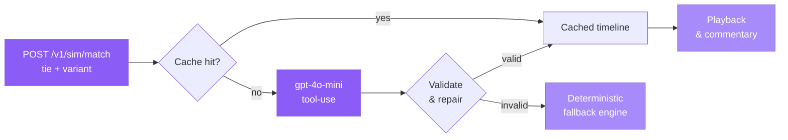

Head to `/simulate` to pit any two nations against each other. The simulator
hands the tie to an AI model, receives a validated match timeline, and plays
it back minute by minute — commentary, crowd audio, a live pitch, and a
betting desk running alongside the action.

## Running a simulation

<Steps>
  <Step title="Pick the nations">
    Use the searchable country picker to choose a home side and an away side
    from the 48 World Cup nations. Type a partial name to filter the list.
  </Step>
  <Step title="Start the match">
    Hit **Simulate**. whistle calls `POST /v1/sim/match` with the tie.
    Responses are cached per tie and variant — so the first call for a given
    fixture is freshly modelled; subsequent calls return the same match
    instantly. If you want a different outcome, re-simulating bumps the
    variant number and the model generates a brand-new fixture.
  </Step>
  <Step title="Watch the playback">
    The response validates and then plays back live: minute-by-minute
    commentary, animated player and ball movement on a flat top-down pitch,
    and crowd audio that swells whenever a goal goes in. Use the speaker
    toggle to mute the crowd.
  </Step>
  <Step title="Use the betting desk">
    Jack's OKB betting desk runs alongside the playback. He reads the live
    action and advises on markets in real time — you can act on his
    suggestions by approving and funding the slip onchain.
    See [Predict](/play/predict) for the full slip flow.
  </Step>
  <Step title="Make substitutions">
    Mid-match, both you and the AI opponent can make substitutions. Changes
    take effect on the next simulated minute and are reflected in the
    animated lineup.
  </Step>
  <Step title="Read the match report">
    At full-time a complete report surfaces: possession, shots, shots on
    target, corners, fouls, cards, goalscorers, and the Man of the Match.
    An **AI-modelled** badge on the report confirms the match was generated
    by the LLM engine rather than a heuristic fallback.
  </Step>
</Steps>

## How the simulation engine works

The call stack from your click to the animated pitch:



The model returns a structured timeline: every event carries a minute, type
(goal, card, corner, penalty), and the player involved. The validator checks
the shape; if anything is malformed the repair step patches it, and if the
result still does not pass the deterministic engine generates a statistically
valid match instead. The UI always gets a complete timeline — it will never
stall waiting for the model.

Simulated stats surfaced in the report include:

```json
{
  "possession": { "home": 54, "away": 46 },
  "shots":      { "home": 14, "away": 9  },
  "shotsOnTarget": { "home": 6, "away": 3 },
  "corners":    { "home": 7, "away": 4 },
  "fouls":      { "home": 11, "away": 13 },
  "offsides":   { "home": 2, "away": 1 }
}
```

<Note>
  The **AI-modelled** badge appears on the report when the response carried
  `source: "llm"`. A heuristic-generated match carries `source: "heuristic"`
  and displays no badge — it is still a valid, complete match report.
</Note>

## Live playback features

| Feature | Detail |
|---|---|
| Animated pitch | Flat top-down field; ball and players move each simulated minute |
| Commentary | Minute-by-minute text commentary for every event |
| Crowd audio | Ambient crowd that swells on goals; speaker toggle to mute |
| Betting desk | Jack reads live action and advises on OKB markets |
| Substitutions | Both sides can sub mid-match; reflected in the animated XI |
| Match report | Full-time stats, scorers, cards, MOTM |

<Tip>
  Re-simulate any fixture as many times as you like — each re-sim bumps the
  variant so you get a genuinely different match, not a replay of the cached
  one.
</Tip>

## Related

<CardGroup cols={2}>
  <Card title="Predict" icon="chart-line" href="/play/predict">
    Build a bet slip and ask Jack for a budgeted recommendation while the
    match is live.
  </Card>
  <Card title="Jack the Bookie" icon="chart-line" href="/agents/jack">
    How Jack reads a tie, prices markets, and talks you through the run of
    play.
  </Card>
</CardGroup>
